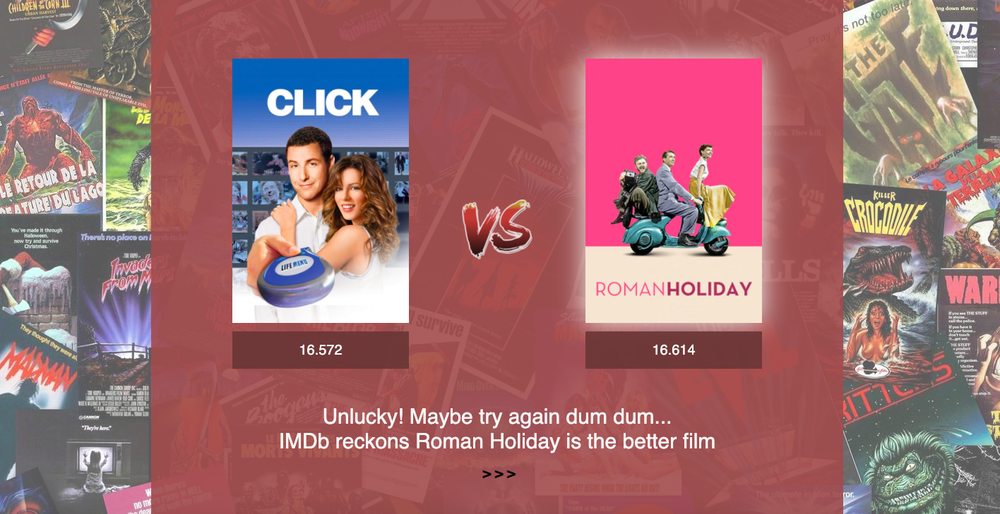
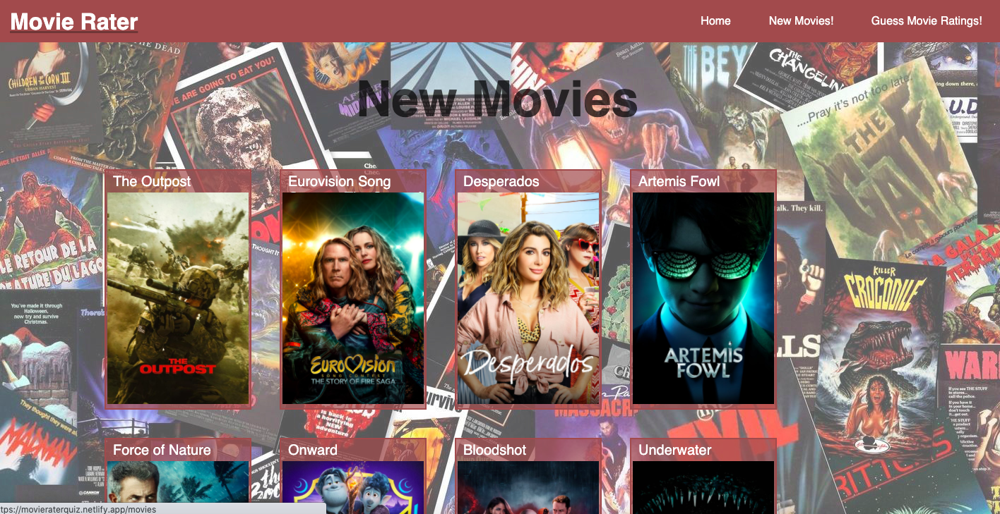
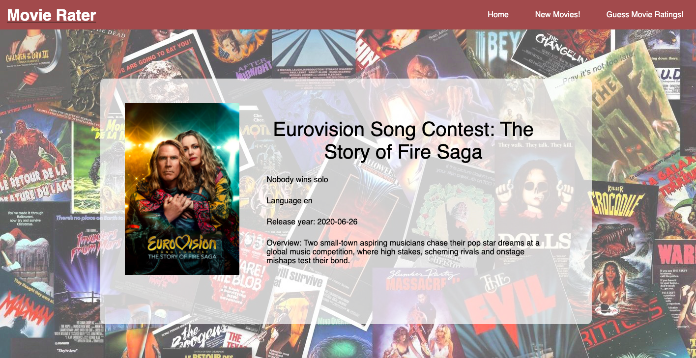

# General Assembly Project 2: MovieRater

### Overview

### Brief
To build a React application that consumes a public API.

### Timescale
48 hours

### Team Mate
Kimberly Tham

### Technologies
- React.js
- JavaScript
- Github
- Insomnia
- Webpack
- Node.js
- Express
- SCSS
- Babel

### Deployment
The application is deployed on Netlify and can be found at https://movieraterquiz.netlify.app/
To install the code for MovieRater:
- Clone or download the repo
- Install Yarn in terminal with command: yarn
- Start server with terminal command: yarn start

### Approach
##### User Experience
The main focus of the website is the game - to choose which one of two films you think is better rated on the Movie Database API. Alongside that, the website provides an index page of the newest films that have recently been released as well as a show page with more information on the film. A landing page was added to improve the user experience. 

##### Functionality
On the game page, the majority of the functionality is focused on the user selecting which of two films they think is better rated. Once the player makes their selection, the page is then updated with the winning choice, whether they have made the right choice, a tongue-in-cheek taunt to encourage them to try again and an animated reset button which, when clicked, resets the game and makes another API call.

To reduce the number of calls made to the API, a selection of 20 films is brought to the website with each call and stored as an array of objects. Two random numbers are then generated and the second is checked to ensure it is different to the first. We chose to structure it like this so that the API returns 20 similarly ranked films to make the choice more closely contested for the player. 

The navbar also includes a link to New Movies which have been released recently. The functionality here is relatively basic, with an index page of film titles and cover posters which, when clicked, link to a show page with further information on the film. 

### Bugs
Mobile responsiveness

### Challenges
Tight timeline

### Future Content

