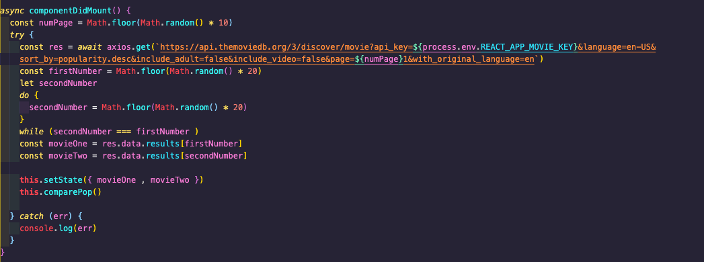

# General Assembly Project 2: MovieRater

### Overview
Movie Rater - a game in which the user chooses which of two films is better rated on the Movie Database API. Built as a pair coded hackathon in 48 hours using react and a publicly available API.

### Brief
To build a React application that consumes a public API.

### Timescale
48 hours

### Team Mate
Kimberly Tham (https://github.com/kimbertham)

### Technologies
- React.js
- JavaScript
- Github
- Insomnia
- Webpack
- Node.js
- Express
- SCSS
- Babel

### Deployment
The application is deployed on Netlify and can be found at https://movieraterquiz.netlify.app/
To install the code for MovieRater:
- Clone or download the repo
- Install Yarn in terminal with command: yarn
- Start server with terminal command: yarn start

### The Build
As we had a limited time to build the app, we spent a decent amount of time choosing the API and a basic concept which would be achievable in the time. We also agreed that some sort of game would be fun as it would require a game logic to work which would be fun to implement. We chose to build the app in React as it allowed for the use of state, both for movie selections and but also for the gameplay.

Planning the build was relatively simple, to get the Axios request working to show two films and then create game logic to evaluate whether the user had made the correct choice. For the Axios request, the data recevied from the API sent information for 20 films per request, and we were able to specify the 'page' from which the 20 films came (the API we used showed the top 200 films so there were 10 pages of 20 films). To ensure that the films were similarly ranked, we took them from the same 20. To choose which of the 10 pages the two films were from, we used a random number. Then to ensure the same film wasn't chosen from the 20 twice, we included a while loop which compared the two film numbers and if the same, iterated the film random number function again. With the two films chosen, we were then able to present this information on the page. The code below shows the film choosing function.

As part of the film choice function, we also ran the comparePop function which compares the popularity of the two films and sets the more popular film in state as 'winner'. For the game page, we used a FilmCard parsed in to the render so that we could reuse the structure and have both films show up in the same way. Underneath each film card we used a button with a function attached to effect the result of whether the player had won or lost by setting state of both the result and which side (left of right) was the correct card. This allowed us to use a terniary statement in the style for each card to check whether that was the winning card and attach different styling to it. The below code show the functionTest function which evaluates which side the player has chosen, compares it to the result from the popularity function held in state and triggers a notification to the user that they either won or lost.

With the above code working, I changed my focus to styling while my partner focused on an additional Axios request to the MovieDB API for new films for the new film page.

### User Experience
The main focus of the website is the game - to choose which one of two films you think is better rated on the Movie Database API. Alongside that, the website provides an index page of the newest films that have recently been released as well as a show page with more information on the film. A landing page was added to improve the user experience. 

### Functionality
On the game page, the majority of the functionality is focused on the user selecting which of two films they think is better rated. Once the player makes their selection, the page is then updated with the winning choice, whether they have made the right choice, a tongue-in-cheek taunt to encourage them to try again and an animated reset button which, when clicked, resets the game and makes another API call.

To reduce the number of calls made to the API, a selection of 20 films is brought to the website with each call and stored as an array of objects. Two random numbers are then generated and the second is checked to ensure it is different to the first. We chose to structure it like this so that the API returns 20 similarly ranked films to make the choice more closely contested for the player. 

The navbar also includes a link to New Movies which have been released recently. The functionality here is relatively basic, with an index page of film titles and cover posters which, when clicked, link to a show page with further information on the film. 

### Bugs and Challenges
The main bug and challenge stemmed from the deadline of 48 hours and is the screen sizing and mobile responsiveness isn't as good as it could be. Given more time, it would have been possible to use media queries to resize items and move from flex rows to columns, however we chose to focus more on getting the game logic, user interaction and user experience aspects of the application thoroughly sorted.

### Wins
Creating a game which is addictive enough to keep playing it! We knew the concept was sound when we found ourselves playing the game rather than continuing to write code! That also gives rise to the second major win, which was I thoroughly enjoyed working with Kimberly on the project, we got on well, communicated excellently and I'm proud of what we achieved.

### Key Learnings and Takeaways
Plan your code no matter how small the project - this is the big takeaway from this project! The end result works and looks good but if I were to do it again, I would use specific functions with a clearer naming convention set out in different pages to aid readability.

### Future Content
The main change to be made in the future would be to improve the mobile and screen size responsiveness using ratios rather than simply fixed pixel sizes, which arose from making the game look good under time pressure to our specific screens. It would also be good to include some search functionality on the index page and on the show page, show similar films or films in the same genre.

